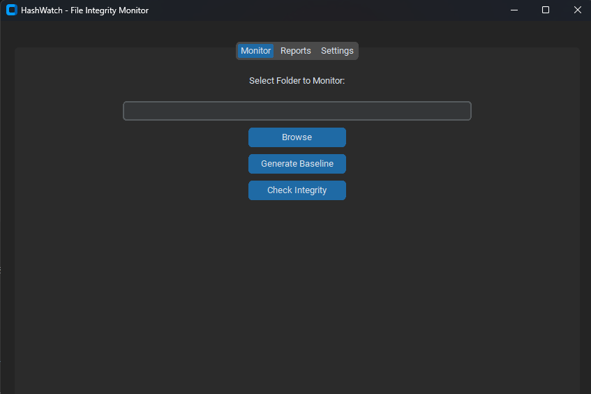
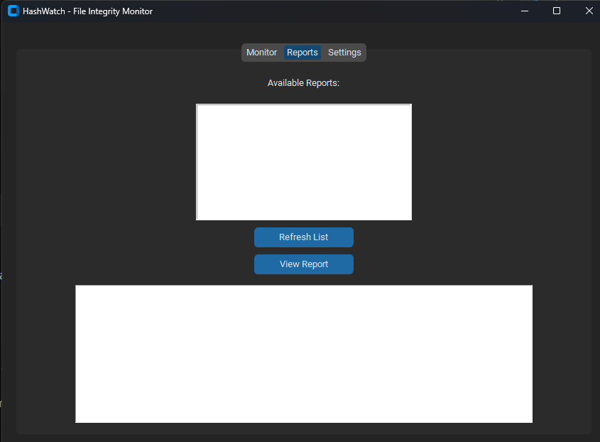
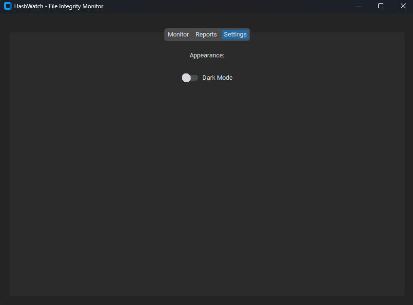

# HashWatch: File System Integrity Checker

HashWatch is a Python-based tool to monitor file system changes by creating baselines of directories and checking for modifications, deletions, or additions. It generates detailed reports and supports hash-based verification.

## Features
- Create and store directory baselines
- Detect file additions, deletions, and modifications
- Hash-based file integrity checking (SHA256)
- Generate easy-to-read reports
- Optional email alerts (coming soon)

Here’s how HashWatch looks in action:

